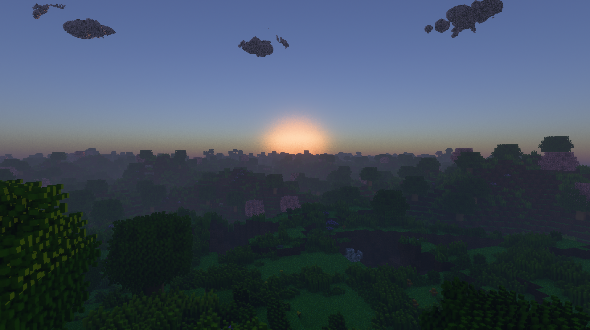
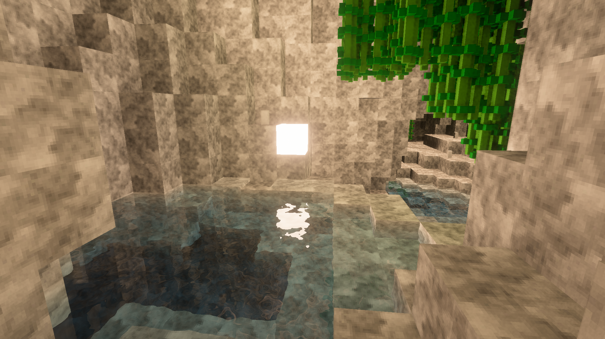
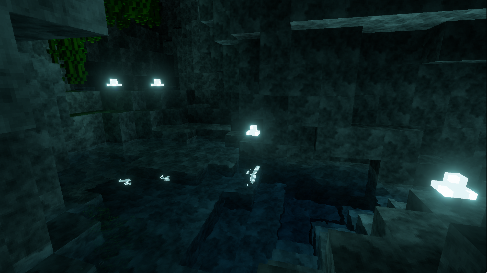
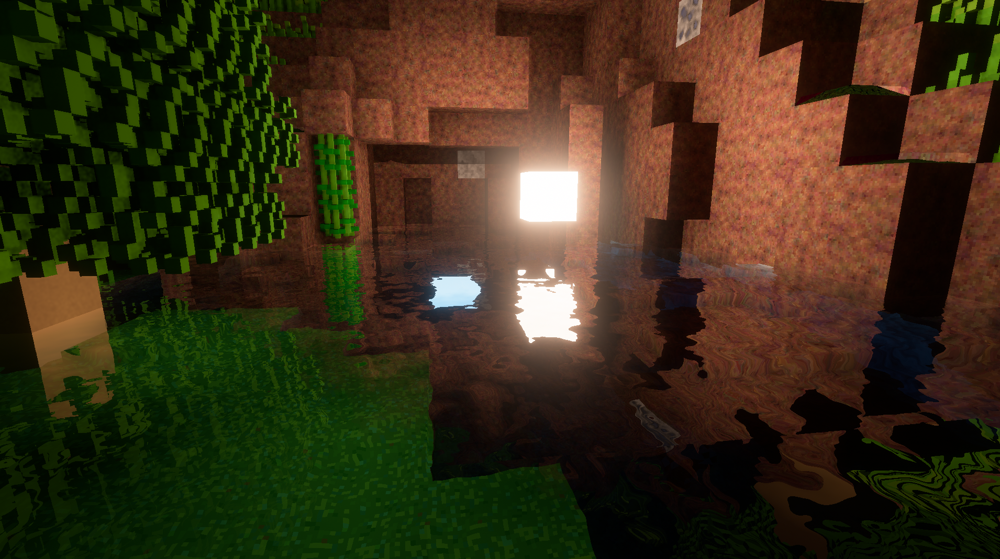

# Viator (working title)

A voxel game with unrealistic ambitions.

## Tech

C++ and Vulkan.

### Storage

Voxels are stored in a simple two-level grid consisting of top-level and bottom-level chunks.
I sometimes call it a brickmap, but I haven't read the paper so I don't know if that's accurate.
Top- and bottom-level chunks both hold 8x8x8 (512) elements, but homogeneous chunks can be collapsed into a single value.
Bottom-level bricks additionally store a bitmask indicating the "occupancy" of each voxel. The occupancy bitmask is used to
improve cache coherency in ray tracing.

A fixed memory pool is employed for the grid structure. It is mirrored exactly on the GPU side, so propagating updates from 
the CPU to the GPU is as simple as marking which pages of the pool were touched by a modification, then copying them into 
the GPU-side representation.

### Rendering

All voxels are rendered with ray tracing using hierarchical DDA. Voxel materials are either simple cubes (textured or not), or they can be "sub-grids" containing their own instanced grid. MagicaVoxel is used to author sub-grid materials.

The renderer has two lighting methods that can be switched between at runtime: a spatial illuminance caching method based on DDGI, and path tracing. Path tracing is intended to be used as a reference, but is fast enough to be playable with the spatial denoiser enabled.

Light is emitted by either voxels or by explicitly sampled local or directional lights.

The renderer also supports translucent and mirror voxel materials.

Rasterized meshes (for dynamic game entities) can be arbitrarily placed and lit, but do not themselves affect lighting.

### Multiplayer

The game supports multiplayer using a client-server architecture. It is extremely slow and insecure, so please only connect to your friends' servers.

## Building

Ensure submodules are fetched by cloning the repository recursively. Then, get a modern version of CMake and do the `mkdir build && cd build && cmake ..`. All dependencies are vendored or fetched with FetchContent, so nothing needs to be installed manually.

The game should build and run on any sufficiently modern desktop GPU on Windows and Linux (I only test on Windows however). If something doesn't work, please create an issue.

## Media

This project was featured in GP-Direct 2025: https://youtu.be/e9qK6EtqB-Q

A link to the clip of this project by itself is here: https://youtu.be/Dxa1-D04SMU

### Images

## Dependencies

### Fetched

- [GLFW](https://github.com/glfw/glfw)
- [GLM](https://github.com/g-truc/glm)
- [volk](https://github.com/zeux/volk.git)
- [vk-bootstrap](https://github.com/charles-lunarg/vk-bootstrap)
- [Vulkan Memory Allocator](https://github.com/GPUOpen-LibrariesAndSDKs/VulkanMemoryAllocator)
- [glslang](https://github.com/KhronosGroup/glslang.git)
- [Dear ImGui](https://github.com/ocornut/imgui)
- [ImPlot](https://github.com/epezent/implot.git)
- [FidelityFX Super Resolution 2](https://github.com/JuanDiegoMontoya/FidelityFX-FSR2.git) (my fork)
- [Tracy](https://github.com/wolfpld/tracy.git)
- [EnTT](https://github.com/skypjack/entt)
- [Jolt Physics](https://github.com/jrouwe/JoltPhysics)
- [FastNoise2](https://github.com/Auburn/FastNoise2)
- [ankerl::unordered_dense](https://github.com/martinus/unordered_dense/)
- [CHOC](https://github.com/Tracktion/choc/)
- [cereal](https://uscilab.github.io/cereal/)
- [miniaudio](https://miniaud.io/)
- [AngelScript](https://www.angelcode.com/)

### Vendored

- [Material Design Icons](https://github.com/google/material-design-icons/)
- [Font Awesome 6](https://github.com/FortAwesome/Font-Awesome/)
- [stb_image.h](https://github.com/nothings/stb)
- [stb_include.h](https://github.com/nothings/stb) (the vendored version is heavily modified)
- [Tony McMapFace LUT](https://github.com/h3r2tic/tony-mc-mapface)
- [AgX shader](https://www.shadertoy.com/view/Dt3XDr)
- Probably several more code snippets that I've forgotten about

## Philosophy

No bikeshedding!
